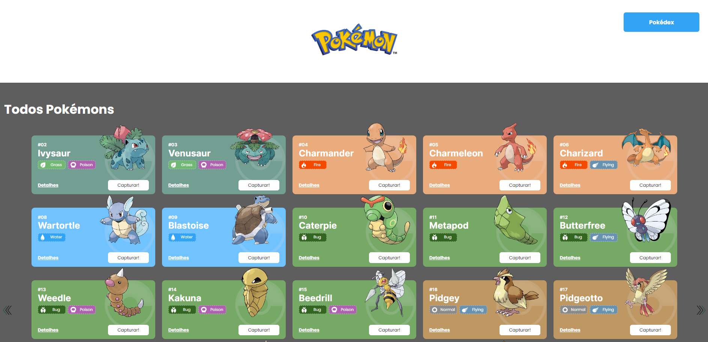

# **Projeto Pokédex**


## Índice

- [Descrição do Projeto]("#descrição-do-projeto")
- [Enunciado]("#enunciado")
- [Requisitos e Funcionalidades do Projeto]("#requisitos-e-funcionalidades-do-projeto")
- [Funcionalidades Adicionais]("#funcionalidades-adicionais")
- [Layout]("#layout")
- [Demonstração]("#demonstração")
- [Concepção do Projeto]("#concepção-do-projeto")
- [Como Rodar Este Projeto]("#como-rodar-este-projeto")
- [Tecnologias Utilizadas]("#tecnologias-utilizadas")
- [Pessoas Autoras]("#pessoas-autoras")
- [Próximos Passos]("#próximos-passos")

## Descrição do Projeto

O Projeto Pokédex é um site de pokémons que possui três páginas: Home, Pokédex e Detalhes. O projeto está subdivido em temas de acordo com os conteúdos estudados durante o Módulo 2 de Frontend.
Este projeto terá como fonte de dados para a sua criação a [Poke Api](https://pokeapi.co/ "Poke Api"), uma API pública, muito usada para aplicações focadas em aprendizado de programação e também usada em cases de processos seletivos.

## Enunciado

É objetivo deste projeto criar um site com três páginas usando a Poke API com as seguintes ferramentas e focos de estudo:

- React
- React Router
- Styled-components
- React Context
- Axios
- Integração de APIs
- Design Systems
- Estado Global

## Requisitos e Funcionalidades do Projeto

- **Requisitos Gerais:**
	- [x] O site deve ter 3 páginas: Home, Pokédex e Detalhes;
	- [x] Projeto deve seguir o [design](https://www.figma.com/file/KseyA2Ofghiek2Cy3ZaDre/Poked%C3%A9x?t=AEi3zEmWmarf1FbP-0 "design") proposto;
	- [x] O fluxo de trocas de páginas devem ser semelhante ao [fluxograma](https://www.figma.com/proto/KseyA2Ofghiek2Cy3ZaDre/Poked%C3%A9x?page-id=0%3A1&node-id=2%3A2&viewport=358%2C197%2C0.27&scaling=scale-down&starting-point-node-id=2%3A2 "fluxograma");
- **Página Home:**
	- [x]  Mostrar uma lista de Pokemons, contendo ao menos 20 Pokemons;
	- [x] Cada Pokemon será representado por um Card;
	- [x] Em cada card de Pokemon tem um botão para adicioná-lo à Pokedex e um outro botão para acessar os detalhes do Pokemon;
	- [x] Header dessa página terá um botão para acessar a página da Pokedex
- **Página Pokédex**
	- [x] Renderizar a lista de pokémons adicionados na pokédex;
	- [x] Em cada card de Pokémon deve ter um botão para removê-lo da Pokédex e um outro botão para acessar os detalhes do Pokémon.
	- [x] Header deve ter um botão para voltar para a Home
	- [x] Não deve ser possível adicionar o mesmo Pokémon duas vezes na Pokédex
- **Página de Detalhes**
	- [x] Mostrar os detalhes do Pokémon selecionado, com informações descritas
	- [x] Header deve ter um botão para adicionar ou remover da Pokédex e outro para voltar a página home.
- [x] [Criar um readme](https://www.youtube.com/watch?v=1QKwP0SJK-c "Crie um readme") para o projeto;

## Funcionalidades Adicionais

- [x] Renderização de mais pokémons, fora os 20 dos requisitos
- [x] Manipulação dos pokémons a serem mostrados na página home com botões laterais

## Layout




## Demonstração

[Link Demonstração](https://flavia-santos-pokedex.surge.sh/)

## Concepção do Projeto

### Criação
- Foi utilizado o VITE

## Como Rodar Este Projeto

```bash
# Clone este repositório
$ git clone linkrepositório

# Acesse a pasta do projeto no seu terminal
$ cd projeto-react-apis

# Instale as dependências
$ npm install

# Execute a aplicação
$ npm run start

```

## Tecnologias Utilizadas

<a href='https://developer.mozilla.org/pt-BR/docs/Web/JavaScript'> </a>
<a href='https://developer.mozilla.org/pt-BR/docs/Web/JavaScript'> </a>
<a href='https://developer.mozilla.org/pt-BR/docs/Web/JavaScript'> </a>
<a href='https://developer.mozilla.org/pt-BR/docs/Web/JavaScript'> </a>
<a href='https://developer.mozilla.org/pt-BR/docs/Web/JavaScript'> </a>

## Pessoas Autoras


[Linkedin Flávia Santos](https://www.linkedin.com/in/flavia-santos-dev/)
